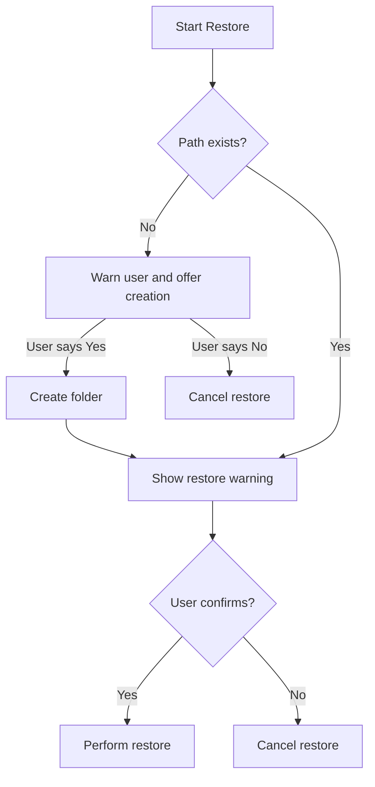

# 🚗 A MotorTown Dedicated Server Backup Script 🚗

## Please read the following
You can rename the script however you like, but please make sure that it contains no **space**.

**Example:**\
Bad: &nbsp;&nbsp;&nbsp;❌ MT Backup.ps1\
Good: ✔️ MT-Backup.ps1\
Good: ✔️ MTBackup.ps1

----------
### Setup Instructions

1.  **Configure Paths**  (Lines 7-9):\
\
$backupRoot = "C:\PATH\TO\BACKUP\FOLDER"\
$sourceFolder = "C:\PATH\TO\MT\SERVERFILES"\
$saveGamePath = "C:\PATH\TO\MT\SAVEGAME"
    
3.  **Run**:
    
    -   Double-click script file, or
        
    -   Execute in PowerShell:  `.\ScriptName.ps1`

## How the script works

## Key Features

1.  **Intuitive Menu System**
    
    -   Single-key navigation (no Enter required)
    -   Color-coded status messages (success/green, errors/red, warnings/yellow)
    -   Clear operation prompts
        
2.  **Flexible Backup Options**
    
    -   **Full Server Backup**: Mirrors entire server directory
        
    -   **Save-Game Backup**: Targets only game save files
        
    -   **Timestamped Archives**: Automatic folder naming (e.g.,  `03.07.2025 - 14-30 - Saved`)
        
3.  **Smart Restore System**
    
    -   Automatic detection of backup type (full server vs. save-games)
        
    -   Missing folder creation with user confirmation
        
    -   Safety prompts to prevent accidental data overwrites
        
    -   Restore path validation
        
4.  **Enterprise-Grade Operations**
    
    -   Robocopy with mirroring (`/MIR`) for efficient delta copying
        
    -   Exit code validation (handles file locks/errors)
        
    -   Retry logic for busy files (`/R:3 /W:5`)
        
5.  **Self-Elevating Privileges**
    
    -   Auto-restarts as Administrator when needed
        
    -   Bypasses execution policy restrictions
        
    -   Handles UAC prompts seamlessly
        
6.  **User Experience Enhancements**
    
    -   Console window sizing/coloring optimization
        
    -   Progress indicators during operations
        
    -   Error trapping with descriptive messages
        
    -   Pause prompts for readability
        

----------

### Technical Requirements

-   **OS**: Windows 7+ (PowerShell 5.1+)
    
-   **Permissions**: Administrator rights (auto-handled)
    
-   **Dependencies**: None (uses native PowerShell/Robocopy)
----------
### Safety Features

-   **Double Confirmation**  for destructive operations
-   **/MIR Protection**: Explicit warnings about file deletion behavior
-   **Path Validation**: Checks existence before operations
-   **Robocopy Exit Codes**: Critical error detection (codes ≥8)
-   **Cancellation Safety**: User can abort at any prompt
