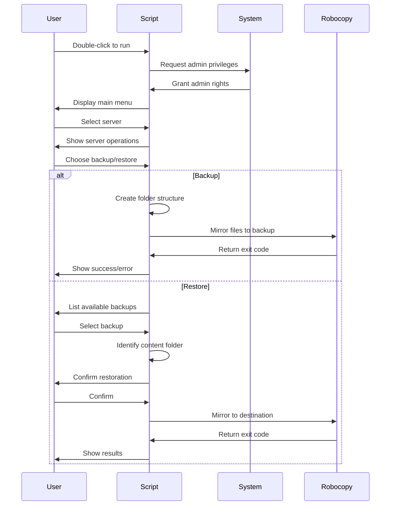
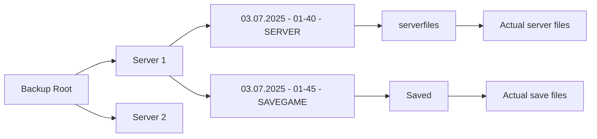

# 🚗 A WGSM Server And Savegame Backup Script 🚗

## Please read the following
You can rename the script however you like, but please make sure that it contains no **space**.

**Example:**\
Bad: &nbsp;&nbsp;&nbsp;❌ Backup Utility.ps1\
Good: ✔️ Backup-Utility.ps1\
Good: ✔️ BackupUtility.ps1

----------
### Setup Instructions

1.  **Configure Paths**
```
# ===== CONFIGURATION =====
$backupRoot = "C:\YOUR\BACKUP\PATH\" #EXAMPLE "C:\Users\Administrator\Desktop\WGSM Backups"

# Define your servers here
$servers = @(
    @{
        Name = "SET SERVERNAME 1 HERE"
        SourceFolder = "C:\PATH\TO\SERVERFILES" #EXAMPLE "C:\Users\Administrator\Desktop\WindowsGSM\servers\1\serverfiles"
        SaveGamePath = "C:\PATH\TO\SAVEGAME"    #EXAMPLE "C:\Users\Administrator\Desktop\WindowsGSM\servers\1\serverfiles\MotorTown\Saved"
    },
    @{
        Name = "SET SERVERNAME 2 HERE"
        SourceFolder = "C:\PATH\TO\SERVERFILES" #EXAMPLE "C:\Users\Administrator\Desktop\WindowsGSM\servers\2\serverfiles"
        SaveGamePath = "C:\PATH\TO\SAVEGAME"    #EXAMPLE "C:\Users\Administrator\Desktop\WindowsGSM\servers\2\serverfiles\SCUM\Saved"
    }
```
2. **Usage**\
   -> **Configure**: Edit server list at script start and set backup path\
   -> **Run**: Double-click script file\
   -> **Navigate**:\
   &nbsp;&nbsp;&nbsp;-  Select server -> Choose operation\
   &nbsp;&nbsp;&nbsp;-  Use single-key nagivation (no Enter needed)\

## How the script works


## Key Features

1.  **Intuitive Menu System**
    
    -   Single-key navigation (no Enter required)
    -   Color-coded status messages (success/green, errors/red, warnings/yellow)
    -   Clear operation prompts
        
2.  **Multi-Server Management**
    
    -   Centralized control for multiple game servers
    -   Server-specific backup/restore operations
    -   Dynamic configuration using hash tables
        
3.  **Intelligent Folder Structure**

-  Automatic folder naming based on source paths

-  Timestamped backups with type identification

-  Content stored in properly named subfolders
4.  **Safety First**
    
    -   Restoration confirmation prompts
    -   Clear warnings about destructive operations
    -   Fallback mechanisms for legacy backups
    -   Color-coded status messages
        
5.  **Smart Operations**
    
    -   Automatic privilege escalation
    -   Robocopy with validation (retries + exit code checking)
    -   Missing folder detection and creation prompts
    -   Backup type recognition during restore
        

----------

### Technical Requirements

-   **OS**: Windows 7+ (PowerShell 5.1+)
    
-   **Permissions**: Administrator rights (auto-handled)
    
-   **Dependencies**: None (uses native PowerShell/Robocopy)
----------
### Safety Features

-   **Double Confirmation**  for destructive operations
-   **/MIR Protection**: Explicit warnings about file deletion behavior
-   **Path Validation**: Checks existence before operations
-   **Robocopy Exit Codes**: Critical error detection (codes ≥8)
-   **Cancellation Safety**: User can abort at any prompt
